 

## Services

Everything below is a real, running repository — status, activity and links point at the actual project.

 

 

## Architecture

 

## Changelog

 

## System load

Refreshed every 6 hours from live GitHub data.

 

