 

## Level select

Every tile is a real repository — status and link point at the actual project.

 

<table><tr>
<td width="50%"></td>
<td width="50%"></td>
</tr><tr>
<td width="50%"></td>
<td width="50%"></td>
</tr><tr>
<td width="50%"></td>
<td width="50%"></td>
</tr><tr>
<td width="50%"></td>
<td width="50%"></td>
</tr></table>

 

## Architecture

 

## Quest log

 

## Power meter

Refreshed every 6 hours via GitHub Actions.

 

