<div align="center">


<br/>

<a href="https://jithubaiju55.github.io/"></a>
<a href="https://linkedin.com/in/jithubaiju"></a>
<a href="mailto:jithubaiju124@gmail.com"></a>

</div>

<br/>

## Model description

| | |
|:--|:--|
| **Developed by** | Jithu Baiju |
| **Model type** | ML Engineer · AI Developer |
| **Base model** | B.Sc. Computer Science (2025) |
| **Languages** | Python · C · Go · Java |
| **Specialties** | Generative AI · RAG · Agentic AI · Computer Vision |
| **Location** | Kerala, India 🇮🇳 |
| **Status** | Exploring cutting-edge LLM applications |
| **License** | Open to collaboration |

<details>
<summary><code>metadata</code></summary>

```yaml
language: [python, c, go, java]
license: open-to-collaboration
base_model: B.Sc. Computer Science (2025)
pipeline_tag: agentic-ai
tags: [genai, rag, agents, computer-vision, pytorch, langchain]
goal: build AI that solves real-world problems
```

</details>

<br/>

## Architecture



<br/>

## Evaluation


<br/>

## Checkpoints

| Checkpoint | Task | Result | Built with |
|:--|:--|:--|:--|
| [**AI-Researcher**](https://github.com/jithubaiju55/AI-Researcher) | Autonomous multi-step web research agent that writes structured reports | **~70%** less manual research time | LangChain ReAct · Llama 3.3 70B · Groq · Streamlit |
| [**RagKB**](https://github.com/jithubaiju55/RagKB) | Fully local RAG chatbot, zero external API dependency | **< 2s** response latency | Ollama embeddings · SQLite vectors · FastAPI · SSE streaming |
| [**Road-Damage-Classification**](https://github.com/jithubaiju55/Road-Damage-Classification) | Classifies road cracks, potholes and normal surfaces | **80%** test accuracy | ResNet18 · PyTorch · Streamlit |
| [**Employee-Attrition-Prediction**](https://github.com/jithubaiju55/Employee-Attrition-Prediction) | Predicts attrition with feature importance and live probabilities | **82%** accuracy | Random Forest · scikit-learn · Pandas · Streamlit |

<br/>

## Training run


<sub>Generated from live GitHub data every 6 hours.</sub>

<br/>

## Intended use

Building agentic systems, retrieval pipelines and vision models that ship.

**Limitations:** early in career. Performs best when handed a real problem and room to build.

## Get started

```python
from jithu import Engineer

me = Engineer.from_pretrained("jithubaiju55")
me.collaborate(topics=["agentic AI", "RAG", "computer vision"])
# → jithubaiju124@gmail.com
```

## Citation

```bibtex
@misc{baiju2026jithu,
  author       = {Jithu Baiju},
  title        = {Jithu Baiju: ML Engineer and AI Developer},
  year         = {2026},
  howpublished = {\url{https://github.com/jithubaiju55}}
}
```

<br/>

<div align="center"><sub><code>jithu-baiju-2025</code> · built to ship · <a href="mailto:jithubaiju124@gmail.com">say hello</a></sub></div>