 

  

  

 

 

  

 

<picture>
  <source media="(prefers-color-scheme: dark)" srcset="https://raw.githubusercontent.com/jithubaiju55/jithubaiju55/output/github-snake-dark.svg" />
  <source media="(prefers-color-scheme: light)" srcset="https://raw.githubusercontent.com/jithubaiju55/jithubaiju55/output/github-snake.svg" />
  
</picture>

 

Open to ML / GenAI roles and collaborations · <a href="mailto:jithubaiju124@gmail.com">jithubaiju124@gmail.com</a>

